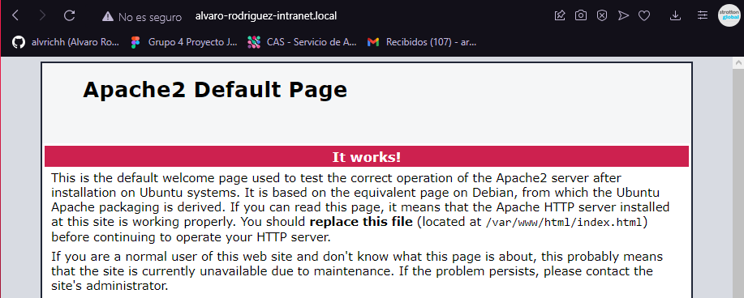
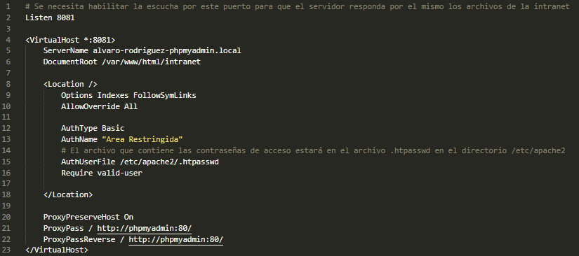
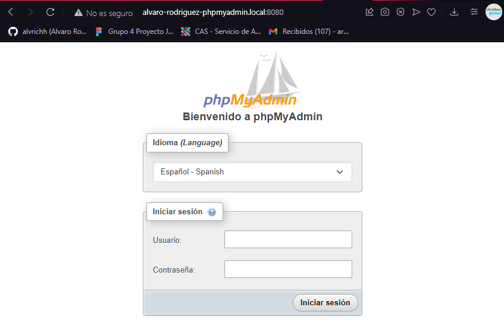
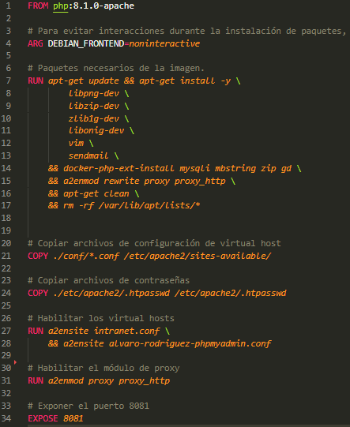
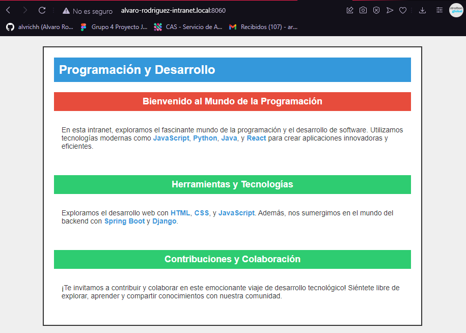

# daweb-docker-lamp
Proyecto para la instalación de LAMP a través de contenedores Docker

```
docker-lamp
├─ .gitignore 
├─ LICENSE
├─ README.md
├─ apache2-php
│  ├─ Dockerfile
│  ├─ conf
│  │  ├─ 000-default.conf
│  │  └─ intranet.conf
│  ├─ etc
│  │  ├─ apache2
│  └─ www
│     ├─ index.html
│     ├─ intranet
│     │  └─ index.html
│     ├─ phpinfo.php
│     └─ test-bd.php
├─ dist
│  ├─ env.dist
│  └─ htpasswd.dist
├─ docker-compose.yml
├─ docs
│  └─ images
└─ mysql
   ├─ conf
   └─ dump
      └─ myDb.sql

```


La estructura del proyecto `docker-lamp` es un entorno de desarrollo LAMP (Linux, Apache, MySQL, PHP) utilizando Docker. A continuación, se describen cada parte de la estructura:

- **.gitignore**: Este archivo indica a Git qué archivos o carpetas ignorar en el control de versiones, como archivos de configuración personales o directorios de compilación. En este caso ignoraremos el archivo con las variables de entorno .env

- **LICENSE**: Contiene información sobre la licencia bajo la cual se distribuye el proyecto, especificando cómo se puede usar o modificar.

- **README.md**: Incluye información sobre el proyecto, como descripciones, instrucciones de instalación, uso y créditos.

- **apache2-php/**: Esta carpeta contiene los archivos relacionados con el servidor web Apache y PHP.
  - **Dockerfile**: Script de instrucciones para construir la imagen Docker para el servidor Apache con PHP.
  - **conf/**: Contiene archivos de configuración para Apache.
    - **000-default.conf**: La configuración predeterminada del Virtual Host para Apache.
    - **intranet.conf**: La configuración del Virtual Host para la intranet, accesible en un puerto específico o subdominio.
  - **etc/apache2/**: Contiene archivos de configuración adicionales para el directorio apache2.
  - **www/**: Directorio que almacena los archivos del sitio web.
    - **index.html**: Página de inicio para el sitio principal.
    - **intranet/**: Carpeta que contiene los archivos para la sección de intranet del sitio.
      - **index.html**: Página de inicio para la intranet.
    - **phpinfo.php**: Script PHP para mostrar información sobre la configuración de PHP.
    - **test-bd.php**: Script PHP para probar la conexión a la base de datos MySQL.

- **dist/**: Contiene plantillas o archivos distribuibles, en este caso una versión de ejemplo del archivo `.env`.
  - **env.dist**: Una plantilla para el archivo de variables de entorno.
  - **htpasswd.dist**: Una plantilla para con usuario de ejemplo inicial para acceder a la intranet

- **docker-compose.yml**: Archivo YAML que define los servicios, redes y volúmenes para el proyecto, organizando y ejecutando múltiples contenedores Docker.

- **docs/**: Directorio destinado a contener documentación del proyecto.
  - **images/**: Imágenes utilizadas en la documentación.

- **mysql/**: Contiene configuraciones y datos relacionados con el servicio de base de datos MySQL.
  - **conf/**: Directorio para archivos de configuración personalizados de MySQL.
  - **dump/**: Contiene archivos de carga de bases de datos, como scripts SQL para inicializar la base de datos.
    - **myDb.sql**: Un script SQL con lo necesario para inicializar la base de datos.

# Guía de Instalación del Proyecto Docker LAMP

Esta guía detalla los pasos para clonar y configurar un entorno Docker LAMP (Linux, Apache, MySQL, PHP) con Virtual Hosts.

## Clonar el Repositorio

Primero, clonar el repositorio Git:

```bash
git clone [URL_DEL_REPOSITORIO]
cd docker-lamp
```

##  Configurar Archivo .env

Copiar el archivo env.dist a .env y personaliza las variables de entorno:

```bash
cp dist/env.dist .env
```

Editar el archivo .env estableciendo los siguientes valores:

```
MYSQL_DATABASE=dbname
MYSQL_USER=root
MYSQL_PASSWORD=test
MYSQL_ROOT_PASSWORD=test
MYSQL_PORT=3307
```

Copiar el archivo htpasswd.dist a ./apache2-php/etc/apache2/ y añade usuarios para acceder a la intranet:

```bash
cp dist/htpasswd.dist ./apache2-php/etc/apache2/.htpasswd
```

Los usuarios tiene el formato:
```
usuario:contraseña
```


La constraseña se puede generar con la utilidad de apache2-utils o directamente usando un [generador online](https://hellotools.org/es/generar-cifrar-contrasena-para-archivo-htpasswd)

## Construir las Imágenes

Construir las imágenes usando Docker Compose:

```bash
docker-compose build
```


## Iniciar los Contenedores

Arrancar los contenedores en modo detached:

```bash
docker-compose up -d
```


Luego hemos cambiado los nombres de acceso a la BD MySQL, y no aparecerá el warning, Commit: [b0d1b76](https://github.com/alvrichh/docker-lamp/commit/b0d1b7620cd448a7cbce05e1c9aa27d70ed83f56)
## Comprobaciones de Prueba

### Creación de un usuario adicional para acceder a la intranet:
Para acceder a al intranet se necesita crear un archivo .htpasswd con los nombres de usuario y sus contraseñas. Se puede usar la herramienta htpasswd para esto. Para ello accede al contenedor daweb-docker-lamp-apache2 a través del terminal mediante el siguiente comando:

```
docker exec -it daweb-docker-lamp-apache2
```

Lanzar el comando que crea un usuario llamado usuario2 y pedirá que se introduzca una contraseña:
```
htpasswd /etc/apache2/.htpasswd usuario2
```

### Prueba de los servicios:
Para probar si los servicios están funcionando correctamente, acceder a los siguientes enlaces a través del navegador:

- **Prueba del sitio principal**: [http://localhost](http://localhost)
 

- **Prueba de la intranet**: [http://localhost:8060 (usando usuario1 y contraseña:123456789 o el usuario creado en el paso anterior)](http://localhost:8060)
  

  

- **Prueba de PHP Info**: [http://localhost/phpinfo.php](http://localhost/phpinfo.php)
  

- **Prueba de Conexión a la Base de Datos**: [http://localhost/test-bd.php](http://localhost/test-bd.php)


- **Prueba de phpmyadmin**: [http://localhost:8080 (con el usuario root y la contraseña establecida)](http://localhost:8080)


## Detener los Contenedores
Para detener y eliminar los contenedores:

```bash
docker-compose down
```

## (Opcional) Configuración
Para acceder a las urls configuradas en los virtual host:
- **Sitio Principal**: [http://www.local](http://www.local)
- **Intranet**: [http://intranet.local:8060 (usando usuario1 y contraseña:123456789 o el usuario creado en el paso anterior)](http://intranet.local:8060)
- **PHP Info**: [http://www.local/phpinfo.php](http://www.local/phpinfo.php)
- **Conexión a la Base de Datos**: [http://www.local/test-bd.php](http://www.localtest-bd.php)
- **Phpmyadmin**: [http://www.local:8080 (con el usuario root y la contraseña establecida)](http://www.local:8080)

Hay que modificar el fichero **/etc/hosts** del sistema operativo anfitrión (no el contenedor de docker) y añadir las siguientes líneas:
```
127.0.0.1	www.local
127.0.0.1	intranet.local
```


## PARTE 1 (VIRTUAL HOST)


Modificamos el nombre de los virtualhost dados de ejemplo para que sean:
- www.local -> nombre-apellidos-www.local
- intranet.local -> nombre-apellidos-intranet.local
- 000-default.conf:


- intranet.conf


- alvaro-rodriguez-phpmyadmin.conf


- # Dockerfile 
 

Habilitamos los módulos de proxy inverso en el Dockerfile de la imágen de apache. Estos módulos son: proxy proxy_http.
Por activamos el módulo de configuración del nombre-apellidos-phpmyadmin.conf en el Dockerfile del fichero apache.

3. Modifica el index.html de la intranet para que tenga otra apariencia distinta a la página por defecto, puede ser cualquier plantilla html "copyleft o free" que encuentres por internet.

## Instalación de Certificados SSL

### Generación de Certificados

Crear un directorio llamado certs en el directorio raiz del proyecto para almacenar los certificados.

Se puede usar el comando:

```bash
mkdir certs
cd certs
```
Descargamos OpenSSL desde este enlace:
[Win64 OpenSSL v3.2.0](https://slproweb.com/products/Win32OpenSSL.html)

Configuramos las variables de entorno:


Hacemos click en Path


Hacemos click en "Nuevo" y colocamos la carpeta bin de OpenSSL


Lanzar el comando de generación de certificados de openssl:

```bash
openssl req -x509 -nodes -days 365 -newkey rsa:2048 -keyout www.key -out www.crt
openssl req -x509 -nodes -days 365 -newkey rsa:2048 -keyout intranet.key -out intranet.crt
```


Este comando crea un certificado (crt) y una clave privada (key) válidos por 365 días.
- x509: Especifica que quieres generar un certificado autofirmado.
- nodes: Crea una clave sin contraseña.
- days 365: El certificado será válido por 365 días.
- newkey rsa:2048: Crea una nueva clave de 2048 bits.
- keyout: El nombre del archivo para la clave privada (normalmente será el nombre del dominio)
- out: El nombre del archivo para el certificado (normalmente será el nombre del dominio)

Durante el proceso, se piden detalles como país, estado, organización, etc. 

Para Common Name (Introducir el nombre del dominio www.local, intranet.local).


### Configurar Virtual Host 443

En cada archivo de configuración agregar una regla como esta replicando la configuración adicional de la ya existente:

```
<VirtualHost *:443>
    ServerName www.local
    SSLEngine on
    SSLCertificateFile /etc/apache2/ssl/www.crt
    SSLCertificateKeyFile /etc/apache2/ssl/www.key
</VirtualHost>

<VirtualHost *:443>
    ServerName intranet.local
    SSLEngine on
    SSLCertificateFile /etc/apache2/ssl/intranet.crt
    SSLCertificateKeyFile /etc/apache2/ssl/intranet.key
</VirtualHost>
```


### Habilitar el módulo mod_ssl

En el Dockerfile de apache2-php se deben copiar los certificados generados, para ello añade la siguiente línea:

```
# Copiar archivos de contraseñas
COPY ./certs /etc/apache2/ssl
```

Además se debe habilitar el módulo ssl, para ello agregar la siguiente línea:

```
RUN a2enmod ssl
```


## (Opcional) Configuración
Para acceder a las urls configuradas en los virtual host:
- **Sitio Principal**: [https://www.local](https://www.local)
- **Intranet**: [https://intranet.local (usando usuario1 y contraseña:123456789 o el usuario creado en el paso anterior)](https://intranet.local)
- **PHP Info**: [https://www.local/phpinfo.php](https://www.local/phpinfo.php)
- **Conexión a la Base de Datos**: [https://www.local/test-bd.php](https://www.localtest-bd.php)

